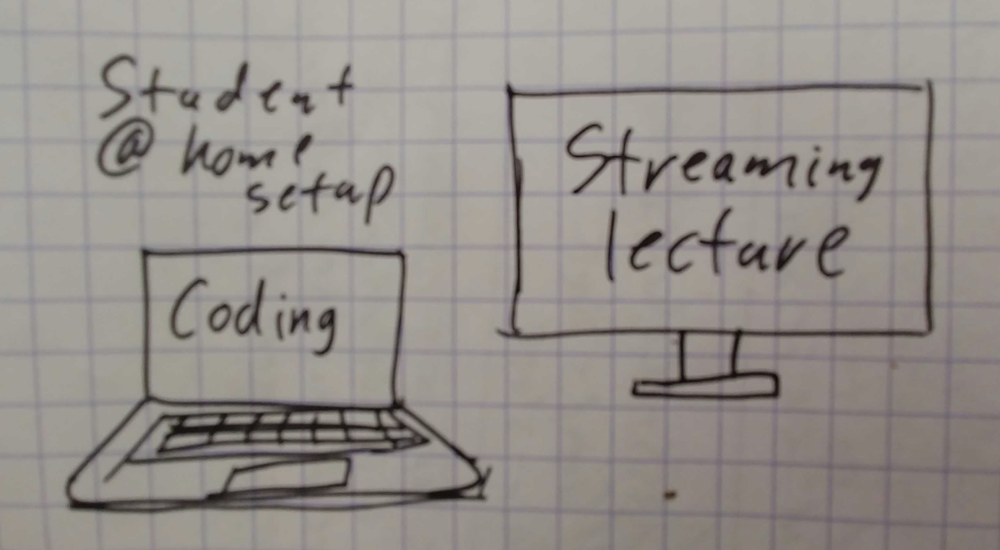

Distance Teaching Overview
---

Online teaching primer: https://vimeo.com/398298167

Lecture
---

This is a simple proceedure that would be used for any time that we'd run a lecture - when you'd have the class gather in the front of the room and have them follow you through a project on whiteboard or on the large monitor. 

Online Lecture vid: https://vimeo.com/398508540

- inform class when lecture starts in the cohort GMeet 
- have the project on which you want to lecture ready 
- have your whiteboard surrogate ready:
 - FS: copy the white.png file in this repo into your project
 - FS: open this in preview and make sure edit mode is enabled
 - FS: note: Live Share Whiteboard was crashing VS Code for me when using for longer periods than a few minutes 
 - FS: make sure to save white.png in the project so the students have it in the repo
- once everyone is in the GMeet:
 - have your camera on and greet students. keep the vibe as "Primey" as possible
 - ensure everyone can hear you (ask them to clap?)
- review our online class rules:
 - be respectful at all times
 - mute your mic when not talking
 - be patient and don't talk over one another 
 - have as much fun as possible
- ask each of them to speak and make sure their mic works (important for if they have questions)
- once everyone can hear you and you have confirmed that you can hear them:
 - FS: begin recording the lecture
 - share your screen and move to the desktop (3 finger swipe) that has the project and/or your whiteboard as needed
 - stay active on the screen. Use the cursor to point out the are about which you are talking, highlight/annotate more than you would in class, and point out when it might be a good moment for them to take a screen cap
 - when questions arise, if it is not necessary to look at the project/whiteboard, enable your camera and engage face to face(s). Ask if the answer was sufficient and get confirmation prior to moving back to the content. 
- when lecture time has completed:
 - conduct "how does everyone feel?" and/or "review" time in camera mode. Go to project/whiteboard only to answer question specifics
 - wrap things up by reminding them know where they can find the artifacts of the lecture (github, Slack, etc) before assigning a follow up assignment (if any)
 
Tier 2 FS students will have a monitor and their setup should look like the following:

Mark is working on securing wacom tablets for instructors so drawing on whiteboard surrogates will be more natural than with touch pad.

Small Group/Pair Coding
---

student instructions/video: https://github.com/PrimeAcademy/liveShareOverview